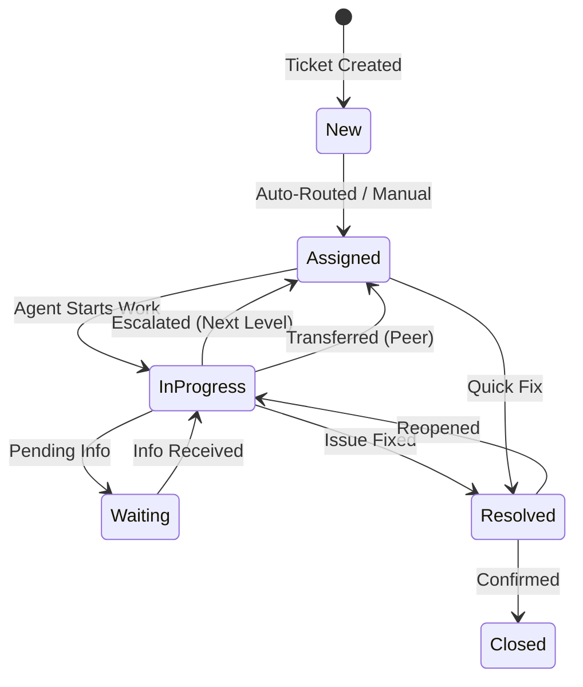
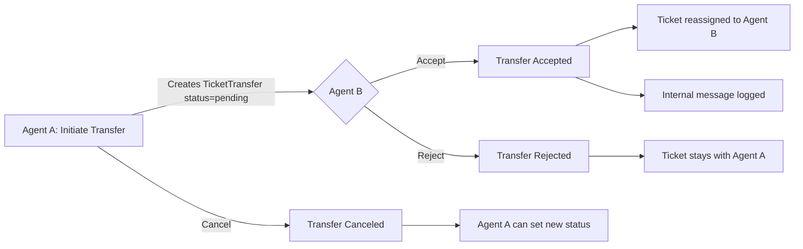

# CSI HR Ticketing System — Complete Reverse Engineering Documentation

> **Project**: CSI HR Ticketing  
> **Stack**: Laravel 11 · Inertia.js · Vue 3 · Tailwind CSS · MariaDB  
> **Auth**: Microsoft Azure AD (OAuth 2.0 Authorization Code Flow)  
> **RBAC**: Spatie Permission (role-based access control)  
> **Location**: `/Users/nisalatp/Projects/CSIHR-Ticket`

---

## 1. System Overview

CSI HR Ticketing is an **enterprise-grade helpdesk and service request management system** built for Cloud Solutions International's shared services model. It implements a multi-department, hierarchical ticket routing engine with SLA management, peer-to-peer transfers, agent workload analytics, and real-time notifications.

### Key Capabilities

| Category | Features |
|:---------|:---------|
| **Ticket Management** | Create, view, status transitions, file attachments, messaging thread |
| **Routing Engine** | Hierarchical level-based auto-assignment with topic matching, load balancing |
| **Escalation** | Level-based escalation within department → Shared Services fallback |
| **Peer Transfers** | Agent-to-agent transfer workflow (initiate → accept/reject/cancel) |
| **SLA Engine** | Business-hours-aware breach calculation, policy scoping by dept/topic/priority |
| **Agent Workspace** | Dedicated dashboard, workload metrics, internal comments |
| **Admin Panel** | Ticket management, manual assignment, agent performance analytics |
| **Configuration** | Departments, levels, topics, users, SLA policies, transfer reasons |
| **Notifications** | Database-driven notification system with event types |
| **Authentication** | Azure AD SSO with profile photo and job title sync |
| **Knowledge Base** | Article/slug-based knowledge base (scaffold) |

### Ticket Lifecycle



---

## 2. Directory Structure

```
CSIHR-Ticket/
├── app/
│   ├── Http/
│   │   ├── Controllers/
│   │   │   ├── Admin/
│   │   │   │   ├── AgentPerformanceController.php
│   │   │   │   └── TicketManagementController.php
│   │   │   ├── Agent/
│   │   │   │   ├── AgentDashboardController.php
│   │   │   │   └── WorkloadController.php
│   │   │   ├── Auth/
│   │   │   │   ├── AuthController.php          # Azure AD OAuth2
│   │   │   │   └── ...                         # Breeze scaffolding
│   │   │   ├── Configuration/
│   │   │   │   ├── DepartmentController.php
│   │   │   │   ├── DepartmentLevelController.php
│   │   │   │   ├── SlaPolicyController.php
│   │   │   │   ├── TopicController.php
│   │   │   │   ├── TransferReasonController.php
│   │   │   │   └── UserController.php
│   │   │   ├── DashboardController.php
│   │   │   ├── KnowledgeBaseController.php
│   │   │   ├── NotificationController.php
│   │   │   ├── ProfileController.php
│   │   │   └── TicketController.php
│   │   └── Middleware/
│   ├── Models/                  # 21 Eloquent models
│   ├── Notifications/
│   │   └── TicketEventNotification.php
│   ├── Observers/
│   │   └── TicketObserver.php
│   ├── Services/
│   │   ├── BusinessHoursService.php
│   │   └── TicketRoutingService.php
│   ├── TokenStore/
│   │   └── TokenCache.php
│   └── Providers/
├── config/
│   └── azure.php
├── database/
│   └── migrations/              # 43 migration files
├── resources/js/
│   ├── Pages/
│   │   ├── Admin/
│   │   │   ├── AgentPerformance/Index.vue
│   │   │   ├── TicketAssignment/
│   │   │   └── Tickets/Index.vue
│   │   ├── Agent/
│   │   │   ├── Dashboard.vue    # 33KB - Main agent workspace
│   │   │   └── Workload.vue     # 13KB - Agent analytics
│   │   ├── Configuration/
│   │   │   ├── Departments/
│   │   │   ├── SlaPolicies/
│   │   │   ├── Topics/
│   │   │   ├── TransferReasons/
│   │   │   └── Users/
│   │   ├── Tickets/
│   │   │   ├── Create.vue       # 19KB - Multi-step ticket form
│   │   │   ├── Index.vue        # Client ticket list
│   │   │   └── Show.vue         # 15KB - Ticket detail + messaging
│   │   ├── KnowledgeBase/
│   │   ├── Dashboard.vue        # Client dashboard
│   │   └── Welcome.vue          # Login page
│   ├── Components/
│   └── Layouts/
├── routes/
│   ├── web.php
│   └── auth.php
└── .env
```

---

## 3. Database Schema

### Engine & Session
- **Connection**: MariaDB (`DB_CONNECTION=mariadb`)
- **Database**: `shared_services_tickets`
- **Session**: Database-backed (`SESSION_DRIVER=database`)
- **Cache**: Database-backed (`CACHE_STORE=database`)
- **Queue**: Database-backed (`QUEUE_CONNECTION=database`)

### Entity-Relationship Diagram

```mermaid
erDiagram
    departments ||--o{ queues : has
    departments ||--o{ ticket_categories : has
    departments ||--o{ tickets : receives
    departments ||--o{ department_levels : has
    departments ||--o{ topics : has
    departments }o--o{ users : "department_user pivot"
    
    users ||--o{ tickets : "requester"
    users ||--o{ tickets : "assignee"
    users ||--o{ ticket_messages : writes
    users }o--o{ topics : "topic_user pivot"
    users ||--o{ users : "manager_user_id"
    
    tickets ||--o{ ticket_messages : has
    tickets ||--o{ ticket_attachments : has
    tickets ||--o{ ticket_status_history : has
    tickets ||--o| ticket_sla_runtime : has
    tickets ||--o{ external_links : has
    tickets ||--o{ ticket_transfers : has
    
    ticket_categories ||--o{ ticket_types : has
    ticket_messages ||--o{ ticket_attachments : has
    
    sla_policies ||--o{ sla_policy_scopes : has
    sla_policies ||--o{ sla_mappings : has
    sla_policies ||--o{ escalation_rules : has
    
    transfer_reasons ||--o{ ticket_transfers : used_in
    
    departments {
        bigint id PK
        string name UK
        boolean is_shared_service
        timestamps
    }
    
    department_levels {
        bigint id PK
        bigint department_id FK
        string name
        int rank
        timestamps
    }
    
    users {
        bigint id PK
        string ms_oid
        string name
        string email UK
        string password
        string job_title
        bigint department_id FK
        bigint manager_user_id FK
        bigint level_id FK
        boolean is_active
        boolean is_admin
        string profile_photo_path
        timestamp email_verified_at
        timestamps
    }
    
    topics {
        bigint id PK
        bigint department_id FK
        string name
        boolean is_active
        timestamps
    }
    
    queues {
        bigint id PK
        bigint department_id FK
        string name
        string assignment_strategy
        bigint lead_user_id FK
        timestamps
    }
    
    ticket_categories {
        bigint id PK
        bigint department_id FK
        string name
        bigint default_queue_id FK
        timestamps
    }
    
    ticket_types {
        bigint id PK
        bigint category_id FK
        string name
        boolean is_confidential
        boolean allow_anonymous
        string icon
        string color_code
        float severity_factor
        timestamps
    }
    
    tickets {
        bigint id PK
        string ticket_no UK
        bigint requester_user_id FK
        bigint department_id FK
        bigint category_id FK
        bigint type_id FK
        bigint queue_id FK
        bigint topic_id FK
        string priority
        string priority_change_reason
        string status
        string subject
        text description
        boolean is_confidential_snapshot
        boolean is_anonymous_snapshot
        bigint sla_policy_id_snapshot FK
        bigint current_assignee_user_id FK
        timestamp assigned_at
        boolean is_escalated
        timestamp sla_breach_at
        float weight
        timestamp resolved_at
        timestamps
    }
    
    ticket_messages {
        bigint id PK
        bigint ticket_id FK
        bigint user_id FK
        string visibility
        text message
        timestamps
    }
    
    ticket_attachments {
        bigint id PK
        bigint ticket_id FK
        bigint message_id FK
        bigint uploader_user_id FK
        string path
        string filename
        string mime
        int size
        timestamps
    }
    
    ticket_transfers {
        bigint id PK
        bigint ticket_id FK
        bigint from_user_id FK
        bigint to_user_id FK
        bigint transfer_reason_id FK
        text notes
        string status
        timestamps
    }
    
    ticket_status_history {
        bigint id PK
        bigint ticket_id FK
        bigint user_id FK
        string status
        bigint changed_by_user_id FK
        string event_type
        text description
        string from_state
        string to_state
        timestamps
    }
    
    ticket_sla_runtime {
        bigint id PK
        bigint ticket_id FK
        timestamp response_due_at
        timestamp resolution_due_at
        timestamp first_response_at
        timestamp resolved_at
        boolean response_breached
        boolean resolution_breached
        timestamps
    }
    
    sla_policies {
        bigint id PK
        string name
        int response_minutes
        int resolution_minutes
        boolean is_active
        timestamps
    }
    
    sla_policy_scopes {
        bigint id PK
        bigint sla_policy_id FK
        bigint department_id FK
        bigint topic_id FK
        string priority
        timestamps
    }
    
    sla_mappings {
        bigint id PK
        bigint department_id FK
        bigint category_id FK
        bigint type_id FK
        string priority
        bigint sla_policy_id FK
        timestamps
    }
    
    escalation_rules {
        bigint id PK
        bigint sla_policy_id FK
        string trigger
        int after_minutes
        string escalate_to
        bigint target_id FK
        string action
        timestamps
    }
    
    external_links {
        bigint id PK
        bigint ticket_id FK
        string system
        string external_key
        string external_url
        string status_snapshot
        timestamp synced_at
        timestamps
    }
    
    audit_logs {
        bigint id PK
        bigint actor_user_id FK
        string entity_type
        bigint entity_id
        string action
        json before_json
        json after_json
        string ip
        timestamp created_at
    }
    
    transfer_reasons {
        bigint id PK
        string name
        boolean is_active
        timestamps
    }
```

### Pivot Tables

| Table | Purpose | Extra Columns |
|:------|:--------|:--------------|
| `department_user` | User ↔ Department membership | `level_id` (FK → department_levels) |
| `topic_user` | User ↔ Topic expertise assignment | — |
| `permissions` tables | Spatie Permission RBAC | Standard Spatie schema |

---

## 4. All Eloquent Models (21)

### `User`
| Field | Type | Notes |
|:------|:-----|:------|
| `ms_oid` | string | Microsoft Object ID |
| `name` | string | Synced from Azure AD |
| `email` | string | Unique, primary identifuer |
| `password` | hashed | Random on creation |
| `job_title` | string | From Graph API |
| `department_id` | FK | Legacy direct department (nullable) |
| `manager_user_id` | FK | Self-referencing hierarchy |
| `level_id` | FK | → department_levels |
| `is_active` | boolean | Account status |
| `is_admin` | boolean | Admin access flag |
| `profile_photo_path` | string | From Graph API photo |

**Relationships**: `belongsTo(Department)`, `belongsTo(User, 'manager_user_id')`, `hasMany(User, 'manager_user_id')` [subordinates], `belongsToMany(Department)` [with pivot level_id], `belongsToMany(Topic)`, `belongsTo(DepartmentLevel, 'level_id')`, `hasMany(Ticket, 'requester_user_id')`, `hasMany(Ticket, 'current_assignee_user_id')`

**Computed**: `is_client` attribute (true if no department memberships), `isSuperAdmin()` (checks config email), `scopeExcludeSuperAdmin`

**Traits**: `HasFactory`, `Notifiable`, `HasRoles` (Spatie)

### `Ticket`
| Field | Type | Notes |
|:------|:-----|:------|
| `ticket_no` | string | Format: `TKT-{8-char-random}` |
| `requester_user_id` | FK | Who created the ticket |
| `department_id` | FK | Target department |
| `category_id` | FK | → ticket_categories |
| `type_id` | FK | → ticket_types |
| `queue_id` | FK | → queues |
| `topic_id` | FK | → topics (nullable) |
| `priority` | string | `Low`, `Medium`, `High`, `Urgent` |
| `priority_change_reason` | string | When priority is changed |
| `status` | string | `New`, `Assigned`, `In Progress`, `Waiting`, `Resolved`, `Closed` |
| `subject` | string | Ticket title |
| `description` | text | Ticket body |
| `is_confidential_snapshot` | boolean | Snapshot from type at creation |
| `is_anonymous_snapshot` | boolean | Snapshot from type at creation |
| `sla_policy_id_snapshot` | FK | Matched SLA policy at calculation time |
| `current_assignee_user_id` | FK | Current agent |
| `assigned_at` | datetime | Set by observer on assignee change |
| `is_escalated` | boolean | Escalation flag |
| `sla_breach_at` | datetime | Calculated SLA deadline |
| `weight` | float | Priority × severity_factor |
| `resolved_at` | datetime | When resolved/closed |

**Observer**: `TicketObserver` is auto-registered via PHP attribute `#[ObservedBy(TicketObserver::class)]`

**Relationships**: `belongsTo(User, 'requester_user_id')`, `belongsTo(Department)`, `belongsTo(TicketCategory, 'category_id')`, `belongsTo(TicketType, 'type_id')`, `belongsTo(Queue)`, `belongsTo(Topic)`, `belongsTo(User, 'current_assignee_user_id')`, `hasMany(TicketMessage)`, `hasMany(TicketAttachment)`, `hasOne(TicketSlaRuntime)`, `hasMany(TicketStatusHistory)`, `hasMany(TicketAssignment)`, `hasMany(ExternalLink)`

### `Department`
| Field | Type | Notes |
|:------|:-----|:------|
| `name` | string | Unique department name |
| `is_shared_service` | boolean | Only one allowed (singleton) |

**Relationships**: `belongsToMany(User)` [with pivot level_id], `hasMany(Queue)`, `hasMany(TicketCategory)`, `hasMany(Ticket)`, `hasMany(DepartmentLevel)` [ordered by rank], `hasMany(Topic)`

### `DepartmentLevel`
| Field | Type | Notes |
|:------|:-----|:------|
| `department_id` | FK | Parent department |
| `name` | string | e.g., "Level 1 Support", "Manager" |
| `rank` | integer | Hierarchy order (1 = lowest) |

**Relationships**: `belongsTo(Department)`, `hasMany(User, 'level_id')`

### `Queue`
| Field | Type | Notes |
|:------|:-----|:------|
| `department_id` | FK | Parent department |
| `name` | string | Queue name |
| `assignment_strategy` | string | Routing strategy type |
| `lead_user_id` | FK | Queue lead/supervisor |

**Relationships**: `belongsTo(Department)`, `belongsTo(User, 'lead_user_id')`, `hasMany(TicketCategory, 'default_queue_id')`, `hasMany(Ticket)`

### `Topic`
| Field | Type | Notes |
|:------|:-----|:------|
| `department_id` | FK | Scoped to department |
| `name` | string | Topic name |
| `is_active` | boolean | |

**Relationships**: `belongsTo(Department)`, `belongsToMany(User)`

### `TicketCategory`
| Field | Type | Notes |
|:------|:-----|:------|
| `department_id` | FK | |
| `name` | string | Category name |
| `default_queue_id` | FK | Auto-assigned queue |

**Relationships**: `belongsTo(Department)`, `belongsTo(Queue, 'default_queue_id')`, `hasMany(TicketType, 'category_id')`, `hasMany(Ticket, 'category_id')`

### `TicketType`
| Field | Type | Notes |
|:------|:-----|:------|
| `category_id` | FK | Parent category |
| `name` | string | Type name |
| `is_confidential` | boolean | Marks sensitive tickets |
| `allow_anonymous` | boolean | Anonymous submission |
| `icon` | string | Display icon |
| `color_code` | string | Display color |
| `severity_factor` | float | Multiplier for weight calculation |

**Relationships**: `belongsTo(TicketCategory, 'category_id')`, `hasMany(Ticket, 'type_id')`

### `TicketMessage`
| Field | Type | Notes |
|:------|:-----|:------|
| `ticket_id` | FK | |
| `user_id` | FK | null = system message |
| `visibility` | string | `public` or `internal` |
| `message` | text | |

**Relationships**: `belongsTo(Ticket)`, `belongsTo(User)`, `hasMany(TicketAttachment, 'message_id')`

### `TicketAttachment`
| Field | Type | Notes |
|:------|:-----|:------|
| `ticket_id` | FK | |
| `message_id` | FK | Can be linked to a message |
| `uploader_user_id` | FK | |
| `path` | string | Storage path (`ticket-attachments/`) |
| `filename` | string | Original filename |
| `mime` | string | MIME type |
| `size` | integer | Bytes |

**Relationships**: `belongsTo(Ticket)`, `belongsTo(TicketMessage)`, `belongsTo(User, 'uploader_user_id')`

### `TicketTransfer`
Peer-to-peer ticket transfer workflow.

| Field | Type | Notes |
|:------|:-----|:------|
| `ticket_id` | FK | |
| `from_user_id` | FK | Initiating agent |
| `to_user_id` | FK | Target agent |
| `transfer_reason_id` | FK | |
| `notes` | text | Optional notes |
| `status` | string | See constants below |

**Status Constants**: `pending`, `accepted`, `rejected`, `canceled`

**Relationships**: `belongsTo(Ticket)`, `belongsTo(User, 'from_user_id')`, `belongsTo(User, 'to_user_id')`, `belongsTo(TransferReason)`

### `TransferReason`
Simple lookup table: `name` (string), `is_active` (boolean).

### `TicketSlaRuntime`
Per-ticket SLA tracking record.

| Field | Type | Notes |
|:------|:-----|:------|
| `ticket_id` | FK | |
| `response_due_at` | datetime | When first response is due |
| `resolution_due_at` | datetime | When resolution is due |
| `first_response_at` | datetime | When first response occurred |
| `resolved_at` | datetime | When actually resolved |
| `response_breached` | boolean | Response SLA missed |
| `resolution_breached` | boolean | Resolution SLA missed |

**Table name**: `ticket_sla_runtime` (custom, not pluralized)

### `TicketStatusHistory`
Full event log for ticket state transitions.

| Field | Type | Notes |
|:------|:-----|:------|
| `ticket_id` | FK | |
| `user_id` | FK | |
| `status` | string | |
| `changed_by_user_id` | FK | |
| `event_type` | string | `assigned`, `status_changed`, `escalated`, etc. |
| `description` | text | Human-readable description |
| `from_state` | string | Previous status |
| `to_state` | string | New status |

### `SlaPolicy`
| Field | Type | Notes |
|:------|:-----|:------|
| `name` | string | Policy name |
| `response_minutes` | integer | First response SLA |
| `resolution_minutes` | integer | Resolution SLA (must ≥ response) |
| `is_active` | boolean | |

**Relationships**: `hasMany(SlaPolicyScope)`, `hasMany(SlaMapping)`, `hasMany(EscalationRule)`

### `SlaPolicyScope`
Determines which tickets a policy applies to (scoping).

| Field | Type | Notes |
|:------|:-----|:------|
| `sla_policy_id` | FK | |
| `department_id` | FK | Nullable (catch-all) |
| `topic_id` | FK | Nullable (catch-all) |
| `priority` | string | Nullable (catch-all) |

**Resolution order**: Most specific scope wins (dept+topic+priority → dept+topic → dept → topic → global fallback).

### `SlaMapping`
Maps specific ticket configurations to SLA policies.

| Field | Type |
|:------|:-----|
| `department_id` | FK |
| `category_id` | FK |
| `type_id` | FK |
| `priority` | string |
| `sla_policy_id` | FK |

### `EscalationRule`
Automated escalation triggers on SLA policies.

| Field | Type | Notes |
|:------|:-----|:------|
| `sla_policy_id` | FK | |
| `trigger` | string | What triggers the escalation |
| `after_minutes` | integer | Delay before escalation |
| `escalate_to` | string | Target type |
| `target_id` | FK | → users (target person) |
| `action` | string | Escalation action |

### `ExternalLink`
Links tickets to external systems.

| Field | Type | Notes |
|:------|:-----|:------|
| `ticket_id` | FK | |
| `system` | string | External system name |
| `external_key` | string | ID in external system |
| `external_url` | string | Link to external system |
| `status_snapshot` | string | Last known status |
| `synced_at` | datetime | Last sync timestamp |

### `AuditLog`
Generic entity audit trail.

| Field | Type | Notes |
|:------|:-----|:------|
| `actor_user_id` | FK | Who performed the action |
| `entity_type` | string | Polymorphic type |
| `entity_id` | bigint | Polymorphic ID |
| `action` | string | Create/Update/Delete |
| `before_json` | JSON | State before change |
| `after_json` | JSON | State after change |
| `ip` | string | Client IP |
| `created_at` | datetime | No `updated_at` |

---

## 5. Ticket Routing Engine (`TicketRoutingService`)

The routing service implements **hierarchical, topic-aware, load-balanced automatic ticket assignment**.

### Initial Routing (`route()`)

```
1. Get all DepartmentLevels for the ticket's department, ordered by rank (lowest first)
2. For each level (bottom → top):
   a. Find an active user at this level who matches the ticket's topic
   b. Among matching users, pick the one with the FEWEST open tickets (load balancing)
   c. If found → assign and return
3. If no topic match at any level:
   a. Try ANY active user at Level 1 (lowest) regardless of topic
   b. If found → assign and return
4. If still unassigned → return null
```

### Escalation (`escalate()`)

```
1. Get current assignee's level rank in the ticket's department
2. Find the next level up (rank > current)
3. Find an available user at that level (topic-matching, load-balanced)
4. If found → reassign ticket, log transition
5. If no higher level or no user → forward to Shared Services department
   a. Find department where is_shared_service = true
   b. Route from scratch within Shared Services using route() logic
```

### Load Balancing

```php
// Among candidates, pick the one with the fewest active tickets
->withCount(['assignedTickets' => fn($q) => 
    $q->whereIn('status', ['Assigned', 'In Progress', 'Waiting'])
])
->orderBy('assigned_tickets_count', 'asc')
->first();
```

### Transition Logging

Every routing/escalation action creates an **internal system message** on the ticket (user_id = null, visibility = 'internal').

---

## 6. SLA Engine

### Ticket Weight Calculation (`TicketObserver`)

Calculated on `creating` and on `updating` (when priority/department/type/topic changes):

```
Weight = PriorityWeight × SeverityFactor
```

| Priority | Base Weight |
|:---------|:------------|
| Low | 1.0 |
| Medium | 2.0 |
| High | 3.0 |
| Urgent | 5.0 |

The base weight is multiplied by `ticket_type.severity_factor` (if set).

### SLA Breach Calculation

1. Find the best matching `SlaPolicyScope` using this priority order:
   - `department_id` + `topic_id` + `priority` (most specific)
   - `department_id` + `topic_id`
   - `department_id` only
   - `topic_id` only
   - Global (all null) — least specific
2. If a policy is found → `sla_breach_at = addBusinessMinutes(created_at, resolution_minutes)`
3. If no policy → default fallback:
   - High/Urgent: 4 business hours
   - Low/Medium: 24 business hours

### Business Hours Service

| Parameter | Value |
|:----------|:------|
| Start Hour | 9:00 AM |
| End Hour | 5:00 PM |
| Workday Hours | 8 hours |
| Weekend | Saturday, Sunday (skipped) |

Two methods:
- `addBusinessMinutes(Carbon $start, int $minutes)` → future deadline
- `getBusinessMinutesElapsed(Carbon $start, Carbon $end)` → elapsed count

---

## 7. Peer-to-Peer Transfer System

### Transfer Flow



### Constraints
- Only one pending transfer per ticket at any time
- Only the current assignee can initiate a transfer
- Only the target agent can accept/reject
- Only the initiator can cancel
- `TransferReason` is required (lookup table)
- On accept: ticket is reassigned, status is updated, internal message logged
- On cancel: initiator can set a new status for the ticket

---

## 8. Authentication System

### Azure AD OAuth 2.0 Flow

Same pattern as CSI Evaluation but with additional data sync:

| Data Synced | Source |
|:------------|:-------|
| `name` | `displayName` |
| `email` | `UserPrincipalName` |
| `job_title` | `jobTitle` (new vs CSIEval) |
| Profile photo | `/me/photo/$value` (inline, not via separate service) |

### User Creation/Update on Login

```php
// New user: auto-creates with random password
User::create([
    'name', 'email', 'job_title', 'profile_photo_path',
    'password' => bcrypt(random),
    'is_admin' => (email === super_admin_email),
    'email_verified_at' => now(),
]);

// Existing user: updates name, job_title, photo from Azure AD
$user->update(['name', 'job_title', 'profile_photo_path']);
```

### Super Admin

Configured via `.env`: `SUPER_ADMIN_EMAIL="nisala.bandara@cloudsolutions.com.sa"`

Checked via `config('app.super_admin_email')` rather than hardcoded (improvement over CSI Eval).

---

## 9. Notification System

### `TicketEventNotification`

Database-only notification (no email/SMS):

```php
// Stored in Laravel's `notifications` table
'via' => ['database']

'toDatabase' => [
    'ticket_id', 'ticket_no', 'event_type', 'message', 'created_by'
]
```

### Event Types

| Event Type | Trigger |
|:-----------|:--------|
| `assigned` | Ticket auto-routed or manually assigned to agent |
| `escalated` | Ticket escalated to higher level |
| `status_changed` | Ticket resolved/closed (notifies requester) |
| `new_message` | Client sends a reply on ticket |

### Notification API

| Endpoint | Method | Description |
|:---------|:-------|:------------|
| `GET /api/notifications` | `index` | List current user's notifications |
| `POST /api/notifications/{id}/read` | `markAsRead` | Mark single notification as read |
| `POST /notifications/read-all` | `markAllAsRead` | Mark all as read |

---

## 10. Agent Workspace

### Agent Dashboard (`Agent/Dashboard.vue` — 33KB)

Displays to the current agent:

1. **My Tickets** — tickets assigned to this agent (with requester, dept, category, topic, type, messages, attachments)
2. **Incoming Transfers** — pending transfers TO this agent
3. **Outgoing Transfers** — pending transfers FROM this agent (filtered out of main list)
4. **Users list** — for initiating transfers
5. **Transfer Reasons** — active reasons for transfer forms

### Agent Actions

| Action | Endpoint | Notes |
|:-------|:---------|:------|
| Update Status | `PUT /agent/tickets/{id}/status` | `Assigned`, `In Progress`, `Waiting`, `Resolved`, `Closed` |
| Add Comment | `POST /agent/tickets/{id}/messages` | Visibility = `internal` by default |
| Escalate | `PUT /agent/tickets/{id}/escalate` | Delegates to `TicketRoutingService::escalate()` |
| Initiate Transfer | `POST /agent/tickets/{id}/transfers` | Requires `to_user_id`, `transfer_reason_id` |
| Accept Transfer | `PUT /agent/tickets/{id}/transfers/accept` | Updates assignee + status |
| Reject Transfer | `PUT /agent/tickets/{id}/transfers/reject` | Leaves ticket with original agent |
| Cancel Transfer | `PUT /agent/tickets/{id}/transfers/cancel` | Cancels and allows status change |

### Agent Workload (`Agent/Workload.vue` — 13KB)

Analytics dashboard showing:

| Metric | Description |
|:-------|:------------|
| Status distribution | Count by status (grouped) |
| Priority distribution | Count by priority (open only) |
| Urgent tickets | Top 10 High/Urgent open tickets |
| Backlog Weight | Sum of `weight` for all open tickets |
| Efficiency % | `(resolved - breached) / resolved × 100` |
| Burndown Rate | `closedLast7Days / openedLast7Days × 100` |
| Resolved by Urgency | Counts per priority level |
| Transfers Out | Total transfers initiated by agent |

---

## 11. Admin Panel

### Ticket Management (`Admin/Tickets/Index`)

Comprehensive ticket oversight with:

**6 Filter Dimensions**: agent, department, type, topic, priority, status + free-text search (ticket_no and subject)

**6 Statistical Aggregations**: by_department, by_agent, by_type, by_topic, by_urgency, by_status

**Admin Actions**:
| Action | Notes |
|:-------|:------|
| Manual Assign | Reassign to any user with optional transfer reason and note |
| Delete Ticket | Permanent deletion |

On manual assignment:
1. Creates a `TicketTransfer` record (status = `Accepted`)
2. Creates internal message with assignment note
3. Sends `TicketEventNotification` to new assignee
4. Creates `TicketStatusHistory` entry

### Agent Performance (`Admin/AgentPerformance/Index`)

Per-agent analytics with filtering by department and topic:

| Per-Agent Metric | Description |
|:-----------------|:------------|
| Open tickets | Currently assigned, not resolved |
| Resolved tickets | Total resolved/closed |
| Resolved by urgency | Breakdown by priority level |
| Backlog weight | Sum of open ticket weights |
| Transfers out | Total transfers initiated |
| Efficiency % | `metSLA / totalWithSLA × 100` |
| Resolved last week | Count in last 7 days |
| Burndown data | Array of 7 daily resolved counts |

**Global Aggregates**: total_open, total_resolved, average_efficiency, total_transfers_out

---

## 12. Client-Facing Features

### Ticket Creation (`Tickets/Create.vue` — 19KB)

| Field | Required | Validation |
|:------|:---------|:-----------|
| Subject | Yes | string, max 255 |
| Description | Yes | string |
| Department | Yes | exists:departments (excludes shared services) |
| Topic | No | exists:topics |
| Type | Yes | exists:ticket_types |
| Priority | Yes | Low, Medium, High, Urgent |
| Attachments | No | Multiple files |

On creation:
1. Auto-creates `General Support` category if none exists for department
2. Auto-creates `General Routing` queue if none exists
3. Sets initial status to `Assigned`
4. Stores all attachments to `ticket-attachments/` (public disk)
5. Calls `TicketRoutingService::route()` for auto-assignment

### Ticket List (`Tickets/Index.vue`)

Groups tickets into three sections:
- **Unassigned**: No assignee, not resolved/closed
- **Progressing**: Has assignee, not resolved/closed
- **Completed**: Status is Resolved or Closed

### Ticket Detail (`Tickets/Show.vue` — 15KB)

Shows full ticket with department, type, topic, assignee, messages (with user info and attachments), and ticket-level attachments.

**Access Control**: Requester can always view their ticket. Assignee can view. Admin can view all.

**Client Messaging**: Clients can reply (visibility = `public`). Sends notification to assignee.

### Client Dashboard (`Dashboard.vue`)

Statistics:
- Total tickets
- Open tickets (New, Assigned, In Progress, Waiting)
- Resolved tickets
- Escalated proxy (High/Urgent priority open tickets)

Same grouped ticket view as Tickets/Index.

---

## 13. Configuration System

### Departments

| Operation | Validation | Notes |
|:----------|:-----------|:------|
| Create | name unique, is_shared_service bool | Only one shared service allowed |
| Update | name unique (except self) | |
| Delete | No users or tickets attached | Fails gracefully |

### Department Levels

| Operation | Validation |
|:----------|:-----------|
| Create | department_id required, name, rank ≥ 1 |
| Update | name, rank |
| Delete | Simple delete |
| Reorder | Accepts array of level_ids, updates rank sequentially (1-indexed) |

### Topics

| Operation | Validation |
|:----------|:-----------|
| Create | department_id required, name required |
| Update | name, is_active |
| Delete | Simple delete |

### Users (Configuration)

No create (users are created at Azure AD login). Update only:

| Field | Description |
|:------|:------------|
| `memberships` | Array of `{department_id, level_id}` — synced to pivot table |
| `topic_ids` | Array of topic IDs — synced to pivot table |
| `is_admin` | Admin flag toggle |
| `is_active` | Active status toggle |

### SLA Policies

| Operation | Validation | Notes |
|:----------|:-----------|:------|
| Create | name, response_minutes ≥ 0, resolution_minutes ≥ response_minutes | Scopes required (≥1) |
| Update | Same as create | Replaces all scopes (delete + recreate) |
| Delete | Simple delete | |

**Scope expansion**: Each scope row can specify `topic_ids[]` array → creates one `SlaPolicyScope` per topic_id.

### Transfer Reasons

Simple CRUD: `name`, `is_active`.

---

## 14. Complete Routing Summary

### Public Routes
| Route | Handler |
|:------|:--------|
| `GET /` | Welcome page |
| `GET /login` | `AuthController::signin` (Azure AD) |
| `GET /callback` | `AuthController::callback` |
| `GET /logout` | `AuthController::signout` |

### Authenticated Routes
| Route | Handler | Description |
|:------|:--------|:------------|
| `GET /dashboard` | `DashboardController::index` | Client dashboard |
| `GET /tickets` | `TicketController::index` | My tickets |
| `GET /tickets/create` | `TicketController::create` | New ticket form |
| `POST /tickets` | `TicketController::store` | Submit ticket |
| `GET /tickets/{id}` | `TicketController::show` | Ticket detail |
| `POST /tickets/{id}/messages` | `TicketController::storeMessage` | Client reply |
| `GET /knowledge-base` | `KnowledgeBaseController::index` | KB listing |
| `GET /knowledge-base/{slug}` | `...::show` | KB article |

### Notification API
| Route | Handler |
|:------|:--------|
| `GET /api/notifications` | `NotificationController::index` |
| `POST /api/notifications/{id}/read` | `...::markAsRead` |
| `POST /notifications/read-all` | `...::markAllAsRead` |

### Agent Routes (`/agent`)
| Route | Handler | Description |
|:------|:--------|:------------|
| `GET /agent/dashboard` | `AgentDashboardController::index` | Agent workspace |
| `GET /agent/workload` | `WorkloadController::index` | Agent analytics |
| `PUT /agent/tickets/{id}/status` | `...::updateStatus` | Change status |
| `POST /agent/tickets/{id}/messages` | `...::storeMessage` | Internal comment |
| `PUT /agent/tickets/{id}/escalate` | `...::escalate` | Escalate ticket |
| `POST /agent/tickets/{id}/transfers` | `...::initiateTransfer` | Start transfer |
| `PUT /agent/tickets/{id}/transfers/accept` | `...::acceptTransfer` | Accept |
| `PUT /agent/tickets/{id}/transfers/reject` | `...::rejectTransfer` | Reject |
| `PUT /agent/tickets/{id}/transfers/cancel` | `...::cancelTransfer` | Cancel |

### Admin Routes (`/admin`)
| Route | Handler | Description |
|:------|:--------|:------------|
| `GET /admin/tickets` | `TicketManagementController::index` | All tickets + stats |
| `PUT /admin/tickets/{id}/assign` | `...::assign` | Manual assign |
| `DELETE /admin/tickets/{id}` | `...::destroy` | Delete ticket |
| `GET /admin/agent-performance` | `AgentPerformanceController::index` | Agent metrics |

### Configuration Routes (`/configuration`)
| Route | Handler | Description |
|:------|:--------|:------------|
| `resource /configuration/departments` | `DepartmentController` | Full CRUD |
| `resource /configuration/users` | `UserController` | List + update |
| `resource /configuration/topics` | `TopicController` | Full CRUD |
| `resource /configuration/levels` | `DepartmentLevelController` | CRUD + reorder |
| `POST /configuration/levels/reorder` | `...::reorder` | Drag-drop reorder |
| `resource /configuration/sla-policies` | `SlaPolicyController` | Full CRUD |
| `resource /configuration/transfer-reasons` | `TransferReasonController` | Full CRUD |

---

## 15. Frontend Architecture

### Technology
- **Vue 3** (Composition API)
- **Inertia.js** — SPA with server-side routing
- **Tailwind CSS** — Utility-first styling
- **Vite** — Build tool

### Page Components

| Area | Page | Size | Description |
|:-----|:-----|:-----|:------------|
| **Client** | `Dashboard.vue` | 9KB | Stats + grouped ticket list |
| **Client** | `Tickets/Create.vue` | 19KB | Multi-field ticket creation form |
| **Client** | `Tickets/Index.vue` | 9KB | Grouped ticket list |
| **Client** | `Tickets/Show.vue` | 15KB | Ticket detail + messaging |
| **Agent** | `Agent/Dashboard.vue` | 33KB | Full agent workspace with transfers |
| **Agent** | `Agent/Workload.vue` | 13KB | Workload analytics dashboard |
| **Admin** | `Admin/Tickets/Index.vue` | — | Ticket management |
| **Admin** | `Admin/AgentPerformance/Index.vue` | — | Agent performance analytics |
| **Config** | `Configuration/Departments/` | — | Department CRUD |
| **Config** | `Configuration/Users/` | — | User management |
| **Config** | `Configuration/Topics/` | — | Topic CRUD |
| **Config** | `Configuration/SlaPolicies/` | — | SLA policy management |
| **Config** | `Configuration/TransferReasons/` | — | Transfer reason CRUD |
| | `Welcome.vue` | 5KB | Login page |

---

## 16. Key Design Decisions

| Decision | Rationale |
|:---------|:----------|
| **Department-User pivot** with level_id | Users can belong to multiple departments at different levels (e.g., L1 in IT, L2 in HR) |
| **Topics as routing hints** | Fine-grained skill matching within departments without complex queue structures |
| **Shared Services singleton** | Single escalation target for unresolvable tickets across all departments |
| **Ticket weight formula** | Combines priority urgency with type severity for nuanced workload calculation |
| **SLA scope specificity ordering** | Most specific matching rule wins, graceful fallback to global defaults |
| **Snapshot fields** on tickets | Captures confidentiality/anonymity/SLA at creation time, immune to future config changes |
| **Peer-to-peer transfers** | Agents can reassign without admin intervention, with formal acceptance workflow |
| **Business hours awareness** | SLA deadlines account for weekends and work hours (9-5) |
| **Database session/cache/queue** | Single-server deployment, no Redis/Memcached dependency |
| **Super admin via env** | Configurable per environment, not hardcoded |
| **Spatie Permission** | Future-proofed RBAC even though currently using simple is_admin flag |
| **Observer pattern for SLA** | Auto-calculates weight and breach time on every ticket create/update |
| **Internal vs public messages** | Agents see all; clients see only public messages |

---

## 17. Composer Dependencies (Key)

| Package | Purpose |
|:--------|:--------|
| `laravel/framework` | Core |
| `inertiajs/inertia-laravel` | Inertia adapter |
| `microsoft/microsoft-graph` | Graph API client |
| `league/oauth2-client` | OAuth2 for Azure AD |
| `spatie/laravel-permission` | RBAC |
| `tightenco/ziggy` | Laravel routes in JS |

---

## 18. Environment Configuration

```env
APP_NAME=Laravel
APP_ENV=local
APP_URL=http://localhost

DB_CONNECTION=mariadb
DB_DATABASE=shared_services_tickets
DB_USERNAME=root

SESSION_DRIVER=database
CACHE_STORE=database
QUEUE_CONNECTION=database
FILESYSTEM_DISK=local

# Azure AD (same tenant as CSI Eval)
OAUTH_APP_ID=8ce3f342-...
OAUTH_SCOPES="openid profile offline_access user.read"
OAUTH_AUTHORITY=https://login.microsoftonline.com/DrSulaimanAlHabib.onmicrosoft.com

SUPER_ADMIN_EMAIL="nisala.bandara@cloudsolutions.com.sa"
```

---

## 19. Migration History (43 Files)

| Migration | Description |
|:----------|:------------|
| `create_cache_table` | Laravel cache |
| `create_jobs_table` | Laravel queue |
| `create_departments_table` | Base: name |
| `create_users_table` | Full user: ms_oid, email, password, job_title, department_id |
| `create_queues_table` | name, assignment_strategy, lead_user_id |
| `create_ticket_categories_table` | department_id, name, default_queue_id |
| `create_ticket_types_table` | category_id, name |
| `create_sla_policies_table` | name, response_minutes, resolution_minutes |
| `create_tickets_table` | Full ticket with all FK references |
| `create_ticket_messages_table` | ticket_id, user_id, visibility, message |
| `create_ticket_attachments_table` | ticket/message refs, path, filename, mime, size |
| `create_ticket_assignments_table` | Assignment tracking |
| `create_ticket_status_history_table` | Status change audit |
| `create_sla_mappings_table` | dept+category+type+priority → SLA policy |
| `create_ticket_sla_runtime_table` | Per-ticket SLA tracking |
| `create_escalation_rules_table` | SLA-triggered escalation |
| `create_audit_logs_table` | Generic entity audit |
| `create_external_links_table` | External system integration |
| `create_permission_tables` | Spatie Permission (6 tables) |
| `add_is_admin_to_users` | + is_admin boolean |
| `create_department_levels_table` | rank-based hierarchy |
| `create_topics_table` | department-scoped topics |
| `add_hierarchical_fields_to_users` | + level_id, manager_user_id |
| `create_topic_user_pivot_table` | User ↔ Topic M:M |
| `add_profile_photo_path_to_users` | + profile_photo_path |
| `add_topic_id_to_tickets` | + topic_id FK |
| `add_is_shared_service_to_departments` | + is_shared_service flag |
| `create_department_user_table` | User ↔ Department pivot with level_id |
| `add_ticket_type_to_tickets` | + type_id FK |
| `add_enhanced_fields_to_ticket_types` | + is_confidential, allow_anonymous, icon, color_code, severity_factor |
| `create_notifications_table` | Laravel notification storage |
| `add_sla_fields_to_tickets` | + sla_breach_at, weight |
| `add_department_and_priority_to_sla_policies` | + dept/priority targeting (later replaced by scopes) |
| `add_topic_to_sla_policies` | + topic targeting |
| `add_priority_change_reason_to_tickets` | + priority_change_reason |
| `create_transfer_reasons_table` | Transfer reason lookup |
| `create_ticket_transfers_table` | Peer transfer records |
| `add_status_to_ticket_transfers` | + status column (pending/accepted/rejected/canceled) |
| `create_sla_policy_scopes_table` | Multi-scope SLA targeting |
| `modify_sla_policies_table_for_scopes` | Refactors SLA policies from direct columns to scope-based |
| `add_resolved_at_to_tickets` | + resolved_at timestamp |
| `add_assigned_at_to_tickets` | + assigned_at timestamp |
| `fix_ticket_status_histories_table` | + event_type, description, from_state, to_state |
